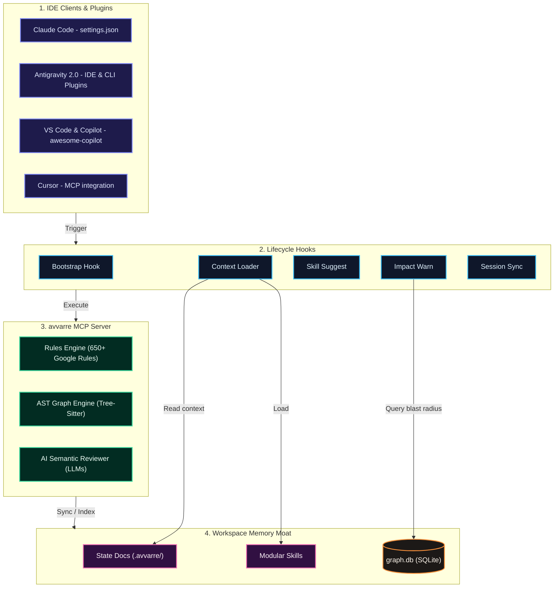

<p align="center">
  
</p>

<h1 align="center">🧠 avvarre</h1>

<p align="center">
  <strong>Stop re-explaining everything to your AI. Just Avvarre it.</strong><br>
  <em>Persistent AI memory · 650+ Google Style Guide rules · 21 languages · One command · Zero configuration</em>
</p>

<p align="center">
  <a href="https://www.npmjs.com/package/avvarre"></a>
  <a href="https://www.npmjs.com/package/avvarre"></a>
  <a href="https://www.npmjs.com/package/avvarre"></a>
  <a href="./LICENSE"></a>
  <a href="./src/analyzer/rules/"></a>
</p>

---

<p align="center">
  <strong>⚡ One command. Every IDE. Zero config.</strong>
</p>

<p align="center">
  <code>npx -y avvarre@latest install</code>
</p>

<p align="center">
  <em>Auto-detects Codex · Cursor · Claude Code · VS Code / Copilot · Antigravity · Zed · OpenCode<br>and installs the MCP server + agent plugins into each one automatically.</em>
</p>

---

## ✨ Features

* **Persistent AI Memory Moat:** Keeps your project context intact across chat sessions through version-controlled files inside the local `.avvarre/` directory.
* **Instant Style Guide Audits:** Locally checks your code against **650+ Google Style Guide rules** in under **100ms** with zero API keys or external cloud dependencies.
* **AST Code Review Graph:** Uses a SQLite-backed dependency tracker (`web-tree-sitter`) supporting 11 languages to compute code blast radius, track inheritance hierarchies, and flag downstream testing gaps.
* **Autopilot Self-Correction Loop:** Enables agents to run `/avvarre-autopilot` to autonomously resolve violations until reaching a **Grade A (90+)** quality score.
* **Lifecycle Hooks Integration:** Hooks directly into bootstrap, prompt loading, impact warnings, and session syncing stages of modern IDE interfaces.
* **IDE & Client Portability:** Installs as an MCP server compatible with **Codex**, **Cursor**, **Claude Code**, **Antigravity 2.0**, **VS Code + GitHub Copilot**, **OpenCode**, and **Zed**.

---

## 🛠️ Tech Stack

* **Core Language:** TypeScript
* **Runtime:** Node.js
* **Parsing Engine:** `web-tree-sitter` (Wasm-based Abstract Syntax Tree parsing)
* **Database:** SQLite (built-in via `node:sqlite`)
* **Supported Environments:** Codex, Cursor, Claude Code, VS Code / GitHub Copilot, Antigravity 2.0, OpenCode, Zed, Claude Desktop

---

## 🚀 Getting Started

### 1. Prerequisites
Ensure you have **Node.js** (v22.5 or higher) and **npm** installed on your local environment. Node 22.5+ is required for the built-in `node:sqlite` module used by the AST graph engine.

### 2. Installation
Initialize all compatible local IDE configurations in a single command:
```bash
npx -y avvarre@latest install
```

### 3. Target Specific IDE Environments
To target specific IDEs and environments, use the corresponding CLI flags:
* **VS Code / Copilot**: 
  ```bash
  npx -y avvarre@latest install --vscode
  ```
* **Cursor**: 
  ```bash
  npx -y avvarre@latest install --cursor
  ```
* **Antigravity (IDE & CLI)**: 
  ```bash
  npx -y avvarre@latest install --antigravity
  ```
* **Claude Code (Bootstrap & MCP)**: 
  ```bash
  npx -y avvarre@latest install --claude
  ```
* **OpenCode**: 
  ```bash
  npx -y avvarre@latest install --opencode
  ```
* **Codex**: 
  ```bash
  npx -y avvarre@latest install --codex
  ```

---

## 💻 Usage

### Slash Commands
Trigger avvarre directly inside your editor or terminal prompt chat:
* `/avvarre` - Audit the currently active file.
* `/avvarre-workspace` - Perform a full repository quality and memory scan.
* `/avvarre-pr` - Audit staged files before commit.
* `/avvarre-init` - Initialize the local `.avvarre/` directory in your workspace.
* `/avvarre-autopilot` - Start the autonomous quality remediation loop.
* `/avvarre-garden` - Audit the persistent memory directory for context drift and stale tasks.

In Codex, these workflows are bundled as Avvarre skills. Select them from the skill picker or invoke them explicitly with `$avvarre`, `$avvarre-init`, `$avvarre-workspace`, `$avvarre-pr`, `$avvarre-autopilot`, or `$avvarre-garden`.

### CLI Commands
avvarre can be executed directly from your terminal:
* `npx avvarre install [--global|--local|--both] [--cursor] [--claude] [--vscode] [--opencode] [--codex] [--antigravity]` - Install the MCP server configuration and agent plugins into your IDEs.
* `npx avvarre check --file <path> [--format score-only|full]` - Quickly analyze and check the quality score and violations of a specific file.

### MCP Tools
avvarre exposes several MCP tools that can be invoked programmatically:
* **`avvarre_file`**: Runs local rules analysis and outputs quality score, list of violations, and drop-in fixes. Takes `workspaceRoot` to auto-log to history.
* **`avvarre_workspace`**: Scans the entire project and outputs a quality score heatmap. Configurable via `ai_depth`, `include_badge`, `include_trends`.
* **`avvarre_pr`**: Evaluates staged git changes and fails below a threshold score (`minScoreThreshold`, default 80).
* **`avvarre_get_impact`**: Queries the AST graph to analyze modification blast-radius, dependency risk scores, and coverage gaps.
* **`list_rules`**: Lists available Google Style Guide rules, filterable by language.
* **`scaffold_avvarre`**: Guided interactive setup for `.avvarre/` workspace assets.
* **`setup_claude_code`**: Bootstrap Claude Code — creates `.claude/`, `.avvarre/`, and `CLAUDE.md`.
* **`suggest_skills`**: Auto-detects package stack and downloads/declines community rules (detect/fetch/decline actions with `.declined.json`).
* **`avvarre_garden`**: Audits the workspace persistent memory folders (`.avvarre/`) to detect context drift, conventions mismatch, and stalled task lists.

> **Resources:** avvarre exposes 21 MCP resources (one per language) at `avvarre://rules/{language}` so AI agents can query rule rationales directly.

---

## ⚙️ Configuration & Architecture Deep-Dive

<details>
<summary>🔍 Why avvarre? (The Problem & The Solution)</summary>

### ⚠️ The Problem
Vibe coding is fast, but AI models quickly lose context:
* **The memory resets:** Every new chat session starts from absolute zero. You spend precious time re-explaining the tech stack, directory paths, and code conventions.
* **Style guides are ignored:** The AI writes code that runs but breaks project style guides—leading to inconsistent naming, undocumented functions, and spaghetti patterns.
* **Verification is manual:** Linters run in your terminal after the fact, not during the AI's generation process. Errors are caught too late.
* **Tooling sprawl:** You need different linters for different languages—ESLint, Ruff, Checkstyle, SwiftLint—or you can just use **avvarre** for all of them.

### 💡 The Solution
**avvarre** is an IDE-agnostic MCP server and agent plugin ecosystem that embeds directly into your AI workflows.

> [!NOTE]
> * **Grade F to Grade A:** Analyzes and suggests clean style guide fixes in milliseconds.
> * **Continuous Handoff:** Dev A works Monday, Dev B pulls Tuesday—the AI immediately catches up on context.
> * **Autopilot Remediation:** Let the AI autonomously clean up its own violations before presenting them to you.
</details>

<details>
<summary>🛡️ Architecture & Core Capabilities (The 8-Layer Engine)</summary>

avvarre operates across 8 layers to lock down quality and context:

* **Layer 1: Persistent AI Memory (The Core Moat)** — Creates a version-controlled `.avvarre/` directory in your workspace storing state documents (`context.md`, `conventions.md`, `tasks.md`, `session-log.md`, `history.json`, and modular `skills/`).
* **Layer 2: Smart Stack Detection** — Scans config files (`package.json`, `go.mod`, etc.) at startup and recommends community rules from [awesome-cursorrules](https://github.com/PatrickJS/awesome-cursorrules). Skipped rules are added to `.declined.json` and never suggested again.
* **Layer 3: Rule-Based Linting Engine** — Instant style guide analysis enforcing Google Style Guides locally with zero API keys or cloud dependencies.
* **Layer 4: AI-Powered Deep Review** — Catches semantic design issues (logical anti-patterns, leaky abstractions, or hard-to-maintain closures) using configured LLMs.
* **Layer 5: Autopilot Loop** — Self-correction loop where the agent autonomously repairs code violations (fixing, checking, and validating) up to 15 times until hitting **Grade A (90+)**.
* **Layer 6: Lifecycle Hooks** — Automates quality and context checks:
  * *Bootstrap:* Prompts to init project memory if `.avvarre/` is missing.
  * *Context Loader:* Injects conventions and task targets into prompt context.
  * *Skill Suggest:* Recommends relevant plugins based on package signatures.
  * *Impact Warn:* AST-aware pre-tool hook checks blast radius of edited files and alerts on downstream risks.
  * *Session Sync & Doc Gardening:* Writes `session-log.md` when the agent exits/goes idle, runs automated context/conventions/tasks freshness audits, and displays warnings to prevent memory rot.
* **Layer 7: IDE Portability** — One MCP server powers all major AI dev clients: Claude Code, OpenCode, Antigravity 2.0, VS Code + GitHub Copilot, Cursor, Zed, and Claude Desktop.
* **Layer 8: AST Code Review Graph** — SQLite-backed dependency graph tracer (`CALLS`, `IMPORTS_FROM`, `INHERITS`, `TESTED_BY`) across **11 languages** (JavaScript, TypeScript, Python, Go, Java, C#, C++, Shell, Kotlin, Swift, Objective-C). Calculates blast radius via recursive CTE queries prior to edits.



### 🗄️ Database Schema (`graph.db`)
Stored locally using `node:sqlite`, the schema tracks code declarations and relationships:
* **`nodes`**: Tracks declarations of files, classes, methods, and functions.
  * `kind`: `'File'`, `'Class'`, `'Function'`, `'Test'`
  * `qualified_name`: Uniquely namespace-scoped identifier (e.g. `src/server.ts::Router::handleRequest`)
  * `file_hash`: SHA-256 hash of the containing file's text content, enabling incremental parsing.
* **`edges`**: Tracks structural links between symbols.
  * `kind`: `'CALLS'` (invocations), `'IMPORTS_FROM'` (module imports / `#include` / `source`), `'INHERITS'` (class inheritance / interface implementation), `'TESTED_BY'` (test-to-production mapping via call-graph + name heuristics).
  * `source_qualified` & `target_qualified`: Connecting node references using the `filePath::Class::method` qualified-name scheme.

### 🛠️ High-Performance AST Extraction
The AST parsing engine ([parser.ts](./src/graph/parser.ts)) uses WebAssembly grammars (`web-tree-sitter`) loaded dynamically on-demand from `tree-sitter-wasms`. It supports **11 languages**: JavaScript, TypeScript (+ TSX), Python, Go, Java, C#, C++, Shell (Bash), Kotlin, Swift, and Objective-C.
* **Language-Accurate Extraction:** Each language uses its verified grammar node types (probed empirically). Classes, functions, tests, imports, and inheritance chains are extracted per language's AST shape—not via regex.
* **Three Edge Types:** `CALLS` (callee names stripped to bare identifiers for cross-file join), `IMPORTS_FROM` (module paths cleaned of quotes), and `INHERITS` (base class / interface names). `TESTED_BY` edges are synthesised post-indexing by `updateTestedByEdges()`.
* **Namespace Scoping:** A `scopeStack` maintains the `filePath::Class::method` hierarchy as the AST is walked depth-first.
* **Incremental Hashing Moat:** On every workspace scan or pre-tool file edit hook, the engine checks the file's current SHA-256 hash. If it matches the database record, the parser bypasses parsing entirely—reducing re-indexing overhead to **<5ms** per file and preventing context scanning latency.

### 📈 Change Risk Calculation Formula
When files are edited, avvarre calculates risk based on test coverage, security tags, and downstream calls:

$$\text{Risk Score} = (\text{Coverage Penalty} + \text{Fan-in Load}) \times \text{Security Multiplier}$$

1. **Test Coverage Penalty:**
   * Symbol lacks `TESTED_BY` edges: **0.30** penalty.
   * Symbol is covered: **0.05** penalty.
2. **Fan-in Call-Graph Load:**
   * Caller count (incoming `CALLS` edges): adds `Math.min(callerCount / 20.0, 0.10)`.
3. **Security Multiplier:**
   * Name matches sensitive tokens (`auth`, `login`, `credential`, `password`, `passphrase`, `token`, `secret`, `admin`, `jwt`, `wallet`, `session`, `encrypt`, `decrypt`, `privatekey`, `private_key`, `apikey`, `api_key`, `oauth`, `sshkey`): **2.5x** multiplier.
   * Otherwise: **1.0x** multiplier.

*The final risk score is normalized and clamped strictly between `0.0` and `1.0`.*

### 🔍 Recursive CTE Blast-Radius Query
avvarre executes a recursive Common Table Expression query up to a depth of 5 hops to trace caller dependencies:
```sql
WITH RECURSIVE impacted(node_qn, depth) AS (
    SELECT qn, 0 FROM _impact_seeds
    UNION
    -- Forward callee traversal
    SELECT n.qualified_name, i.depth + 1
    FROM impacted i
    JOIN edges e ON (e.source_qualified = i.node_qn OR i.node_qn LIKE '%::' || e.source_qualified)
    JOIN nodes n ON (n.qualified_name = e.target_qualified OR n.qualified_name LIKE '%::' || e.target_qualified)
    WHERE i.depth < 5
    UNION
    -- Backward caller traversal
    SELECT e.source_qualified, i.depth + 1
    FROM impacted i
    JOIN edges e ON (e.target_qualified = i.node_qn OR i.node_qn LIKE '%::' || e.target_qualified)
    WHERE i.depth < 5
)
SELECT DISTINCT node_qn, MIN(depth) AS min_depth
FROM impacted
GROUP BY node_qn LIMIT 200;
```
If downstream caller dependencies exist, the edit process halts and prompts a context warning.

### 🛡️ Language Rules & Grading Logic

#### Grading Scale
* **Grade A (90–100):** Google-grade quality code.
* **Grade B (80–89):** Minor style points only.
* **Grade C (70–79):** Needs attention.
* **Grade D (60–69):** Heavy style violations.
* **Grade F (0–59):** Critical structural issues.

> [!TIP]
> Penalties are weighted by severity: `critical = 15`, `high = 10`, `medium = 5`, `low = 2`. Large files are dynamically dampened using log-normalization so they are not unfairly penalized.

#### Language Support (650+ Rules)
| Language | Rules | Language | Rules | Language | Rules |
|:---|:---:|:---|:---:|:---|:---:|
| **TypeScript** | 74 | **Dart** | 49 | **Shell** | 37 |
| **JavaScript** | 49 | **Python** | 46 | **C++** | 44 |
| **Kotlin** | 40 | **Objective-C** | 42 | **C#** | 37 |
| **Java** | 39 | **Go** | 33 | **Swift** | 35 |
| **R** | 36 | **Vimscript** | 19 | **Lisp** | 26 |
| **HTML** | 16 | **CSS** | 15 | **Markdown** | 17 |
| **JSON** | 16 | **XML** | 16 | **Angular** | 16 |
</details>

<details>
<summary>🔌 Configuration, Plugins & Manual Setup</summary>

### 🔑 LLM Provider Configuration
avvarre is offline-first, but you can configure external LLM providers for semantic deep reviews:

* **Gemini:** Set the following environment variables:
  ```bash
  AI_PROVIDER="gemini"
  GEMINI_API_KEY="your-gemini-api-key"
  ```
* **OpenAI:** Set the following environment variables:
  ```bash
  AI_BASE_URL="https://api.openai.com/v1"
  AI_API_KEY="your-openai-api-key"
  AI_MODEL="gpt-4o"
  ```
* **Local Models (Ollama / LM Studio):** Set the base URL pointing to your local endpoint:
  ```bash
  AI_BASE_URL="http://localhost:11434/v1"
  AI_MODEL="your-local-model"
  ```

### 📂 Persistent Memory Structure (.avvarre/)
avvarre creates a version-controlled directory at the root of your project:
* [context.md](./.avvarre/context.md) — Project purpose, tech stack, and system architecture.
* [conventions.md](./.avvarre/conventions.md) — Custom styling preferences, naming rules, and patterns.
* [tasks.md](./.avvarre/tasks.md) — Compact task tracker designed for AI ingestion.
* [session-log.md](./.avvarre/session-log.md) — AI handoff log from the last active session.
* [history.json](./.avvarre/history.json) — Quality score tracking history.
* [skills/](./.avvarre/skills/) — Modular feature guidelines and domain-specific rules.

Instead of bloating context by feeding the AI your entire repository, avvarre dynamically loads only the relevant skill file for the active task (e.g., `database_schema_rules.md`, `react_ui_guidelines.md`).

### 📦 Monorepo Support
To enable monorepo support, set `chat.useCustomizationsInParentRepositories` to `true` in your VS Code settings. Place avvarre at the root:
```
monorepo/
├── awesome-copilot/  ← avvarre hooks, agent, skills, commands (VS Code)
├── cursor-plugin/    ← avvarre hooks, agent, skills, commands (Cursor)
├── .avvarre/          ← Shared project memory
└── packages/
    ├── frontend/     ← Open this folder — hooks still fire
    └── backend/      ← Open this folder — hooks still fire
```

### 🔌 Manual Plugin Setup
If you prefer to configure integrations manually, use the following configurations:

#### Claude Code
Copy `claude-plugin/` to your workspace and add it to `.claude/settings.json`:
```json
{
  "plugins": ["./claude-plugin"]
}
```

#### VS Code + GitHub Copilot
Copy `awesome-copilot/` to your workspace and add this to your global VS Code settings:
```json
{
  "chat.plugins.enabled": true,
  "chat.plugins.paths": ["./awesome-copilot"]
}
```

#### Cursor
Add avvarre to your Cursor MCP settings panel:
* **Name:** `avvarre`
* **Type:** `command`
* **Command:** `npx -y avvarre@latest`

#### Codex
You can automatically set up the Codex plugin using the installer (`npx -y avvarre@latest install --codex`). Alternatively, this repository includes a Codex plugin at [`plugins/avvarre`](./plugins/avvarre/) and a repository marketplace at [`.agents/plugins/marketplace.json`](./.agents/plugins/marketplace.json). Open the repository in the ChatGPT desktop app, restart it, select **Avvarre Plugins**, and install **Avvarre**. Review and trust the bundled hooks before they run.

For a Git-backed marketplace, add the repository with `codex plugin marketplace add PralhadYadawad/avvarre`, then install `avvarre` from the `avvarre` marketplace. Public availability uses the official plugin submission portal.

#### Antigravity 2.0 (IDE & CLI)
Copy `antigravity-plugin/` to:
* **Workspace:** `.agents/plugins/avvarre`
* **Global IDE:** `~/.gemini/config/plugins/avvarre`
* **Global CLI:** `~/.gemini/antigravity-cli/plugins/avvarre`

### 🤖 AI Review Agent (@avvarre-reviewer)
The `@avvarre-reviewer` agent acts as a virtual auditor inside your chat workspace:
1. Gathers context and runs `avvarre_file` on changed files.
2. Orders fixes sequentially (high severity first).
3. Modifies code, re-runs verification, and updates [tasks.md](./.avvarre/tasks.md) dynamically on success.
</details>

<details>
<summary>💎 Strategic Moats, Use Cases & Philosophy</summary>

### 💎 Strategic Moats
* **Token Optimization & Context Moat:** Traditional code agents reload entire code files or subdirectories to understand impact, burning through context windows. avvarre solves this by indexing the project architecture in a local, fast database—loading only the necessary symbols when requested.
* **Offline First & Airgapped Compliance:** The core linting engine, SQLite DB, and tree-sitter parser run 100% locally. There is no telemetry, external network requests, or cloud dependency.
* **Multi-IDE Handoff Sync:** The `.avvarre/` directory acts as a portable memory block. Dev A using Cursor and Dev B using Claude Code share the same session context, task states, and architecture guidelines.
* **Graceful Degradation Moat:** The server never blocks the developer. If an LLM key is missing, it runs local regex checks. If a file is too large for the model, it auto-chunks. If the AST parser fails, it defaults back to file-level lint rules.

### 🎯 Key Use Cases
* **Continuous Handoff in Distributed Teams:** When developers swap tasks, the AI reads the `session-log.md` and `tasks.md` to pick up exactly where the last agent left off—eliminating onboarding handoff friction.
* **AST-Guided Quality Gates (CI/CD):** Run `avvarre_pr` in your PR pipeline or pre-commit hooks to verify that code changes do not decrease the overall repository quality score below a set threshold.
* **Blast-Radius Visual Warnings:** During large refactors, the agent is immediately warned if modifying a shared method would break downstream endpoints, prompting it to write corresponding unit tests.

### 🎨 Design Philosophy
* **Zero configuration to start:** Out-of-the-box linting runs locally in <100ms. No cloud keys needed.
* **Graceful degradation:** Gracefully falls back to regex analysis if LLM keys are absent, chunks files if too large, and never blocks code editing.
* **Bypass memory limits:** Scopes rule-sets and tasks into modular skills, avoiding context window clutter.
* **Single Tool, Every Stack:** Replaces fragmented quality chains with a single standard MCP engine.

### 🔍 Under the Hood
* **Hardened Tokenizer:** The `getCleanLines` utility strips out comments and raw strings before rules execute. This eliminates false positives triggered by URLs in strings or notes in comments.
* **AST-Aware Chunker:** Files exceeding LLM token capacities (~500 lines) are safely split at class/function AST boundaries using a parser-driven chunker ([chunker.ts](./src/ai/chunker.ts)) across all 11 supported languages, reviewed individually per chunk, and merged with corrected line numbers. Falls back to line-based splitting if AST parsing is unavailable.
* **Direct Resources:** Every language style guide exposes rules as a `avvarre://rules/{language}` resource endpoint for agents to query.

### 📝 The Compressed Task Protocol
AI agents communicate across sessions using a compact format inside [tasks.md](./.avvarre/tasks.md):
```markdown
[x] Built user auth flow (steps: schema→routes→middleware→tests→docs)
[/] Refactoring payments (done: extract-service→add-types | next: update-routes→tests)
[ ] Add rate limiting to API endpoints
```
Agents parse these steps directly into their working memory context, resolving context drift during task handoffs.
</details>

---

## 🛣️ Roadmap & Contributing

We welcome contributions to expand rulesets, IDE plugins, and integrations.

### Local Development
1. Clone the repository:
   ```bash
   git clone https://github.com/PralhadYadawad/avvarre.git
   ```
2. Install dependencies:
   ```bash
   npm install
   ```
3. Build the project locally:
   ```bash
   npm run build
   ```
4. Start the server:
   ```bash
   npm start
   ```

### Troubleshooting
If lifecycle hooks fail to execute:
1. Enable agent debug logs inside your VS Code settings:
   ```json
   "github.copilot.chat.agentDebugLog.enabled": true
   ```
2. Reload your IDE.
3. Run `/troubleshoot` in Copilot Chat to review logs.

---

## 📜 License

This project is licensed under the **MIT License**. See the [LICENSE](./LICENSE) file for details.
