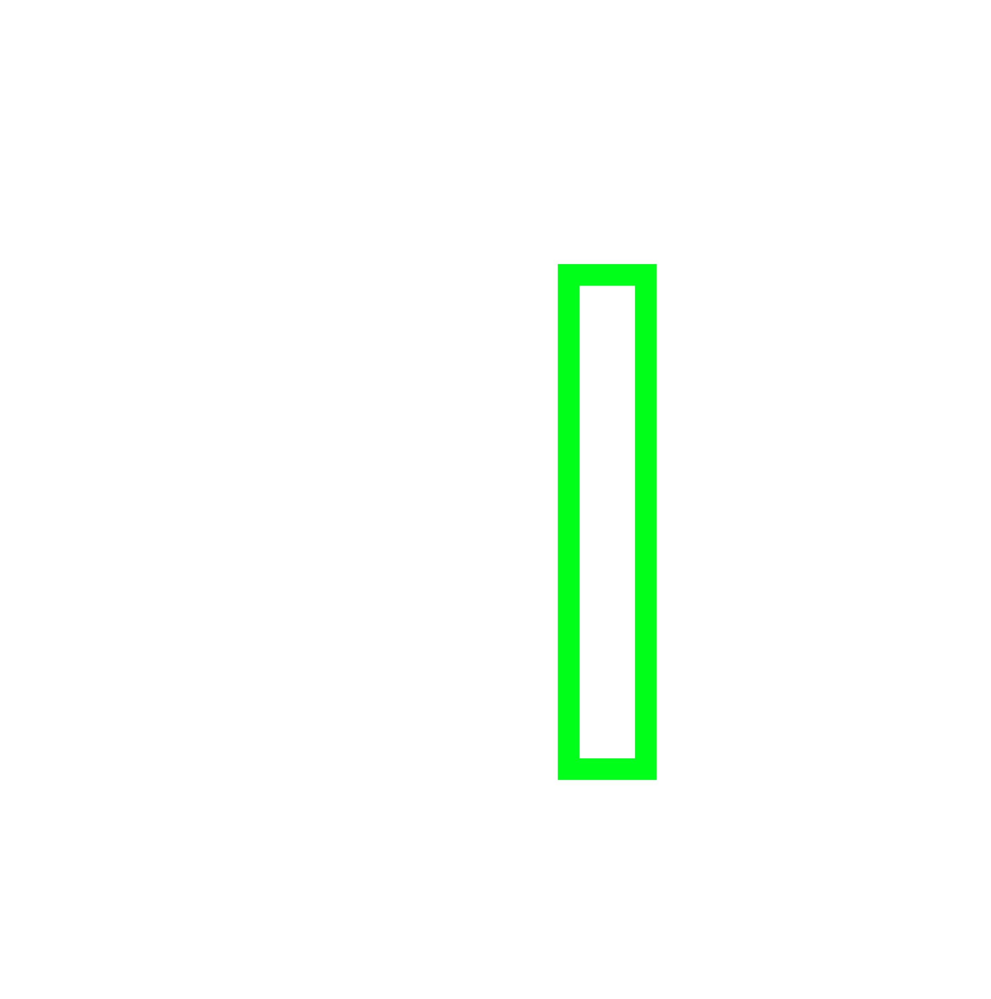

<p align="center">
  
</p>

# avvarre

**Stop re-explaining everything to your AI. Just Avvarre it.**

Your AI forgets the project every session. It ignores your style guide. It generates 500 lines of unmaintainable code before you finish reading the diff. avvarre fixes all three.

- **Persistent memory** -- `.avvarre/` committed to git. Context, conventions, tasks, session logs. Dev A works Monday, Dev B pulls Tuesday, the AI already knows.
- **650+ Google Style Guide rules** -- 21 languages. Local regex scan in <100ms. No API key. No cloud.
- **AI deep review** -- Catches what rules can't: misleading docstrings, logic smells, architectural anti-patterns. Gemini, OpenAI, Groq, Ollama -- or skip it entirely. Silent fallback.
- **Autopilot** -- `/avvarre-autopilot` picks the worst violation, fixes it, re-verifies, repeats. Grade A or 15 iterations. No babysitting.
- **25x less context** -- Targeted skill files (~8K tokens) instead of dumping your whole repo (200K+).
- **Every IDE** -- One MCP server. VS Code, Cursor, Claude Code, Claude Desktop, any MCP client. Same `.avvarre/` memory everywhere.

---

## What It Does

### Persistent AI Memory

`.avvarre/` is committed to git -- your AI's long-term brain:

- **`context.md`** -- project purpose, tech stack, architecture, key decisions
- **`conventions.md`** -- naming rules, patterns, team preferences
- **`tasks.md`** -- compressed step chains for AI handoffs
- **`session-log.md`** -- what happened last session

Switch machines. Switch developers. Switch IDEs. The AI picks up where the last session left off.

### Executable Memory (Skills)

`/avvarre-init` generates targeted skill files in `.avvarre/skills/` based on your stack -- React guidelines, Node API patterns, database schema rules. The AI loads only the relevant skill for the current task instead of your entire codebase.

### Smart Skill Detection

Auto-detects your stack by scanning `package.json`, `go.mod`, `Cargo.toml`, config files, and file extensions -- then suggests community skills from [awesome-cursorrules](https://github.com/PatrickJS/awesome-cursorrules). Declined skills are remembered per-skill and never suggested again.

---

## Install

The MCP server starts automatically when the plugin is enabled. No manual setup.

For optional AI deep review, add env vars to `.vscode/mcp.json`:

```json
{
  "mcpServers": {
    "avvarre": {
      "command": "npx",
      "args": ["-y", "avvarre@latest"],
      "env": {
        "AI_BASE_URL": "https://api.groq.com/openai/v1",
        "AI_API_KEY": "your-key",
        "AI_MODEL": "llama-3.3-70b-versatile"
      }
    }
  }
}
```

---

## Commands

| Command | What it does |
|---------|-------------|
| `/avvarre` | Analyze the active file -- score, violations by severity, exact fixes |
| `/avvarre-init` | Set up `.avvarre/` project memory (detects your stack, generates skill files) |
| `/avvarre-workspace` | Audit the entire project -- heatmap ranked worst-to-best |
| `/avvarre-pr` | Quality gate on git-changed files only |
| `/avvarre-autopilot` | Autonomous fix-verify loop until Grade A (90+) |
| `/avvarre-garden` | Audit `.avvarre/` memory for context drift, stale tasks, and conventions mismatches |

## MCP Tools

| Tool | Purpose |
|------|---------|
| `avvarre_file` | Regex + AI review -- score, violations, exact fixes. Take `workspaceRoot` to auto-log to history |
| `avvarre_workspace` | Scan directory -- heatmap, score trends, badge. Configurable via `ai_depth`, `include_badge`, `include_trends` |
| `list_rules` | Browse all 650+ rules by language |
| `scaffold_avvarre` | Create `.avvarre/` from guided questions |
| `setup_claude_code` | Bootsrap Claude Code — creates `.claude/`, `.avvarre/`, and `CLAUDE.md` in one command |
| `avvarre_pr` | PR quality gate on git diff. Takes optional `minScoreThreshold` (default 80) |
| `suggest_skills` | Auto-detect stack, fetch community skills (detect/fetch/decline actions with `.declined.json`) |
| `avvarre_get_impact` | Query AST graph for blast-radius, risk scores, and test-coverage gaps |
| `avvarre_garden` | Audits persistent memory for drift and stale tasks |

> **Resources:** avvarre exposes 21 MCP **resources** (one per language) at `avvarre://rules/{language}` so AI agents can read rule rationale directly.

## The Agent

`@avvarre-reviewer` is a specialized code reviewer persona that:

1. Scans code using `avvarre_file` -- gets score, violations, fix suggestions
2. Fixes by severity -- critical first, low last
3. Re-verifies after every fix -- never assumes fixes are clean
4. Updates `.avvarre/tasks.md` automatically

## Hooks

4 hooks fire automatically -- no manual invocation needed:

| Hook | When | Action |
|------|------|--------|
| Bootstrap | Session start | Suggests `.avvarre/` setup if missing |
| Context Loader | Session start | Reads conventions + loads matching skill for the current task |
| Skill Suggest | Session start | Auto-detects stack, suggests community skills for new frameworks |
| Impact Warn | Pre-tool (write/edit) | Queries `graph.db` AST for downstream callers and test gaps before any file edit |
| Session Sync & Garden | Session end | Updates session-log.md, runs doc-gardening audits, and alerts of memory rot/drift |

## Under the Hood

- **Hardened Tokenizer** -- Strips comments and strings before regex analysis, eliminating false positives
- **Smart Chunking** -- Large files are auto-split into semantic chunks for AI review
- **`.avvarre/ignore`** -- Skip generated files, vendored code, or directories you don't control

## Cross-Platform

avvarre isn't locked to one IDE. One MCP server, every platform:

| Platform | How |
|----------| ----|
| VS Code + Copilot | This plugin (hooks + agent + commands) |
| Cursor | Plugin with hooks, agent, commands, .cursorrules |
| Claude Code | Plugin with hooks, skills, commands |
| OpenCode | Plugin with hooks, TUI commands (`/avvarre:*`), AST impact alerts |
| Antigravity | Plugin with hooks, agents, rules, skills, commands |
| Claude Desktop | MCP config in `claude_desktop_config.json` |
| Any MCP client | `npx -y avvarre@latest` |

The `.avvarre/` memory directory is shared across all platforms via git.

---

## Links

- [GitHub](https://github.com/PralhadYadawad/avvarre)
- [npm](https://www.npmjs.com/package/avvarre)

**License**: MIT
